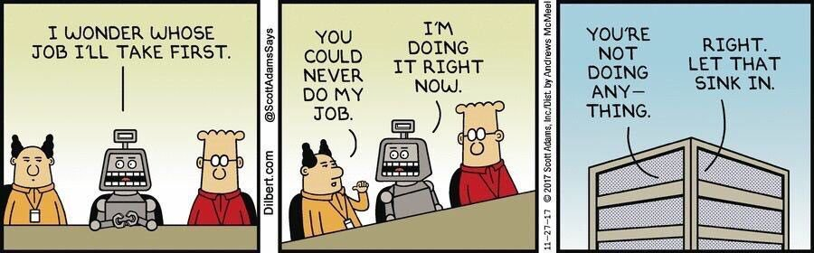

# What is this mini voice assistant?

A little fun project using the React speech recognition hook and a few APIs to produce --- BAM! a small, not-so-smart mini assistant that will listen to a few commands and grant your orders.

# What can it do?
- [x] " Give me a number fact "
- [x] " open (a site) " e.g. google.com/ github.com/ linkedin.com
- [x] " How old am I if my name is (your name) "
- [x] " I'm bored "
- [x] " Reset "
- [x] " Stop "
- [x] " Change background to trees "
- [ ] " Tell me the weather in (city) "
- [ ] " Give me the weekly forecast " (only in Sydney)
- [ ] " Give me a recipe "
- [ ] " Play me some study music "
